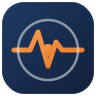

<div align="center">
  
  <h1>Observabilidad y Monitoreo en AWS</h1>
  <p><strong>Curso práctico de 5 clases con laboratorios en AWS CloudFormation.</strong></p>
  <p>
    
    
    
    
  </p>
  <p>🌐 <strong>Sitio del curso:</strong> <a href="https://fjanuszewski.github.io/observabilidad-monitoreo-aws/">fjanuszewski.github.io/observabilidad-monitoreo-aws</a></p>
</div>

---

Programa a medida enfocado en el **ciclo completo de observabilidad sobre AWS**:
recolección de métricas, logs y trazas; archivado y rotación; explotación de
datos para *troubleshooting*; y respuesta automatizada a incidentes. Pensado
para equipos que operan entornos productivos y quieren fortalecer el monitoreo
operativo y la gestión proactiva.

El programa es **100 % práctico** y está construido alrededor de la
infraestructura como código: cada clase incluye un laboratorio en
**CloudFormation** que despliega una parte del sistema de observabilidad. Los
cinco laboratorios se encadenan sobre una arquitectura común, de modo que al
finalizar se obtiene un **entorno de observabilidad completo, reproducible y de
punta a punta**.

## 🎯 A quién está orientado

Perfiles de **operaciones, soporte técnico, SRE/DevOps y administración de
sistemas** que necesiten monitorear y operar entornos productivos en AWS. Se
recomienda contar con conocimientos básicos de AWS (cómputo, redes y
almacenamiento) y familiaridad con la línea de comandos.

## 📚 Las 5 clases

| # | Clase | Servicios protagonistas | Laboratorio |
|---|-------|-------------------------|-------------|
| 1 | [Fundamentos, métricas y monitoreo de EC2 con CloudWatch](clase-1-fundamentos-metricas-cloudwatch/) | CloudWatch · EC2 · CloudFormation · Systems Manager | Stack base (VPC + EC2 + agente) publicando métricas del SO y una métrica personalizada |
| 2 | [Logs: recolección, lectura y retención](clase-2-logs-recoleccion-retencion/) | CloudWatch Logs · KMS | Logs a un log group con retención, *metric filter* de errores con alarma y consulta guardada de Logs Insights |
| 3 | [Archivado, ciclo de vida y explotación con Athena](clase-3-archivado-lifecycle-athena/) | Data Firehose · S3 · Glacier · Glue · Athena | Pipeline de archivado (subscription filter → Firehose → S3 con lifecycle) + consulta SQL de investigación en Athena |
| 4 | [Observabilidad de contenedores (ECS + Fargate)](clase-4-observabilidad-contenedores-ecs-fargate/) | ECS · Fargate · Container Insights · FireLens · X-Ray | Clúster ECS/Fargate con Container Insights y logs por FireLens; métricas y logs correlacionados |
| 5 | [Alertas, respuesta automatizada y cierre end-to-end](clase-5-alertas-respuesta-automatizada/) | CloudWatch Alarms · EventBridge · SNS · Lambda · SSM | Alarmas (compuesta + anomalía), EventBridge → runbook de SSM, notificación por SNS y dashboard unificado |

## 🧭 Cómo usar este repositorio

Cada carpeta `clase-N-*/` es autocontenida y tiene tres piezas:

1. **Presentación** — `presentacion/index.html`. Abrila en el navegador (doble
   clic o `file://`). Navegá con `←` / `→`, `O` para vista general y `F` para
   pantalla completa. Explica cada servicio con diagramas de arquitectura.
2. **Laboratorio** — `laboratorio/template.yaml`. Plantilla de CloudFormation
   lista para desplegar. Es simple, de bajo costo y borrable.
3. **Guía paso a paso** — `laboratorio/guia.html`. Recorrido guiado desde que
   abrís la consola de AWS hasta que terminás y limpiás, con checkpoints y
   *troubleshooting*.

> 💡 **Tip para presentaciones y guías:** para evitar restricciones de `file://`
> en algunos navegadores, podés servir el repo con un servidor local:
> ```bash
> python3 -m http.server 8000
> # luego abrí http://localhost:8000/
> ```

## 🏗️ Arquitectura end-to-end

El sistema de observabilidad se construye de forma incremental a lo largo de las
clases, cubriendo el ciclo completo:

```
                    ┌──────────── Clase 5: Alertas y respuesta ────────────┐
                    │  CloudWatch Alarms → EventBridge → SNS / SSM runbook  │
                    └───────────────────────▲──────────────────────────────┘
   Clase 1              Clase 2                 Clase 3               Clase 4
 EC2 + Agent   →   CloudWatch Logs   →   Firehose → S3 → Athena   ECS + Fargate
  (métricas)        (logs + filtros)      (archivado + SQL)     (contenedores)
      │                   │                      │                     │
      └───────────────────┴──── Métricas · Logs · Trazas ─────────────┘
                         Amazon CloudWatch (plano de observabilidad)
```

## ⚠️ Costos y limpieza

Todos los laboratorios usan recursos de **bajo costo** (EC2 `t3.micro`, buckets
chicos, single-AZ). Aun así, **cada guía termina con una sección de limpieza**:
al borrar el stack de CloudFormation se eliminan todos los recursos. Ejecutá la
limpieza al terminar cada laboratorio para no dejar nada facturable.

## 🗂️ Estructura del repo

```
observabilidad-monitoreo-aws/
├── README.md
├── assets/                       # Sistema de diseño compartido (CSS, JS, íconos)
├── docs/
│   ├── GUIA-DE-ESTILO.md         # Estándares de coherencia entre clases
│   └── _plantilla/               # Plantillas "gold standard" de deck y guía
├── clase-1-fundamentos-metricas-cloudwatch/
├── clase-2-logs-recoleccion-retencion/
├── clase-3-archivado-lifecycle-athena/
├── clase-4-observabilidad-contenedores-ecs-fargate/
└── clase-5-alertas-respuesta-automatizada/
```

## 📄 Licencia

[MIT](LICENSE) — material educativo de libre uso.

---

<div align="center">
  <sub>Al finalizar, los participantes cuentan con un entorno de observabilidad completo desplegado como código, además de las técnicas para monitorear, diagnosticar y responder ante incidentes en entornos productivos de AWS.</sub>
</div>
