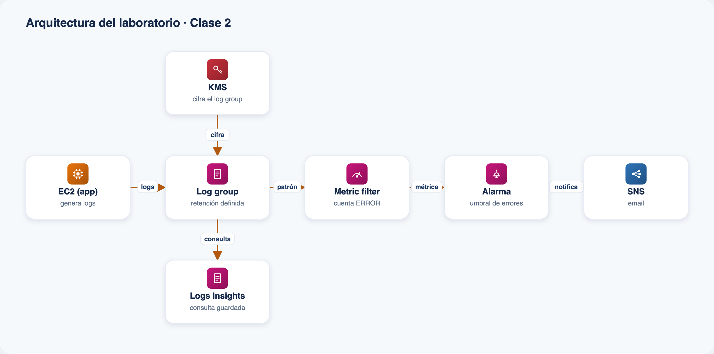

# Laboratorio · Clase 2 — Logs: recolección, lectura y retención

Pipeline completo de logs: una app en **EC2** publica sus logs en **CloudWatch Logs**,
se define su **retención**, un **metric filter** cuenta los errores, una **alarma**
avisa cuando superan un umbral y una **consulta guardada de Logs Insights** ayuda a
investigarlos. Todo declarado en una plantilla de **CloudFormation**.

## Arquitectura



*Todos los componentes que despliega `template.yaml`.*

## Qué despliega

| Recurso | Servicio | Para qué |
|---|---|---|
| Instancia `t3.micro` + agente de CloudWatch | EC2 | Genera una app de ejemplo y publica sus logs |
| Log group con `RetentionInDays` | CloudWatch Logs | Almacena los logs y define la rotación (1 día a 10 años) |
| Metric filter `contar-errores` (`DefaultValue: 0`) | CloudWatch Logs | Convierte líneas `ERROR` en la métrica `Obs/Clase2/AppErrorCount` |
| Alarma `obs-clase-2-errores` | CloudWatch Alarms | Pasa a `ALARM` al superar el umbral de errores |
| QueryDefinition `Obs-Clase2/Errores-por-periodo` | CloudWatch Logs | Consulta de Logs Insights reutilizable |
| Topic + suscripción SNS (opcional) | SNS | Notifica por email al disparar la alarma |
| KMS key + alias (opcional) | KMS | Cifra el log group en reposo |
| Rol e instance profile | IAM | Autoriza al agente a escribir en Logs (mínimo privilegio) |

> El metric filter, la alarma y Live Tail solo se crean/funcionan con `LogGroupClass=STANDARD`.
> Con `INFREQUENT_ACCESS` el log group es más barato pero solo se consulta con Logs Insights.

## Requisitos

- Cuenta de AWS con permisos para EC2, CloudWatch Logs, IAM, SNS y KMS.
- Una **VPC por defecto** en la región (la instancia se lanza ahí, sin abrir puertos).
- AWS CLI v2 configurada (para la vía CLI) o acceso a la consola.
- Región sugerida: **us-east-1**.
- Al desplegar hay que aceptar **`CAPABILITY_NAMED_IAM`** (se crean roles con nombre).

## Parámetros principales

| Parámetro | Default | Descripción |
|---|---|---|
| `LatestAmiId` | SSM AL2023 | AMI resuelta por SSM (no se hardcodea) |
| `InstanceType` | `t3.micro` | Tipo de instancia |
| `VolumeSize` | `8` | Disco raíz gp3 (GiB) |
| `LogGroupName` | `/obs/clase-2/app` | Log group destino |
| `RetentionInDays` | `7` | Retención del log group |
| `LogGroupClass` | `STANDARD` | `STANDARD` o `INFREQUENT_ACCESS` |
| `ErrorThreshold` | `1` | Errores por período que disparan la alarma |
| `EnableKmsEncryption` | `false` | Cifra el log group con una KMS key propia |
| `NotificationEmail` | `""` | Email para SNS (vacío = sin topic) |

## Deploy rápido

### Consola

1. **CloudFormation › Create stack › With new resources**.
2. Subí `template.yaml` en *Upload a template file*.
3. Nombre `obs-clase-2`, revisá parámetros (opcional: `NotificationEmail`, `EnableKmsEncryption`).
4. Aceptá la capacidad IAM y **Submit**. Esperá `CREATE_COMPLETE`.

### CLI

```bash
aws cloudformation deploy \
  --stack-name obs-clase-2 \
  --template-file template.yaml \
  --parameter-overrides file://parameters.example.json \
  --capabilities CAPABILITY_NAMED_IAM \
  --region us-east-1
```

Ver los logs en vivo y el estado de la alarma:

```bash
aws logs tail /obs/clase-2/app --follow --region us-east-1
aws cloudwatch describe-alarms --alarm-names obs-clase-2-errores-obs-clase-2 --region us-east-1
```

## Validación de la plantilla

```bash
export PATH="$HOME/Library/Python/3.9/bin:$PATH"
cfn-lint template.yaml   # 0 errores
```

## Costo

Diseñado para **< USD 1** si limpiás al terminar: una `t3.micro`, disco `gp3` de 8 GiB,
single-AZ y un volumen bajo de ingestión de logs. La KMS key (si la habilitás) tiene un
costo mensual mínimo prorrateado; el topic SNS por email es gratuito para este volumen.

## Limpieza

```bash
aws cloudformation delete-stack --stack-name obs-clase-2 --region us-east-1
```

Borra la instancia, el log group (con sus logs), el metric filter, la alarma, la
consulta guardada y —si los creaste— el topic SNS y la KMS key. No hay
`DeletionPolicy: Retain`, así que no queda nada facturable. Si habilitaste KMS, la key
queda en *Pending deletion* durante su ventana de espera y luego se elimina sola.

> Este laboratorio no crea buckets S3, por lo que no hay objetos que vaciar antes de borrar.
