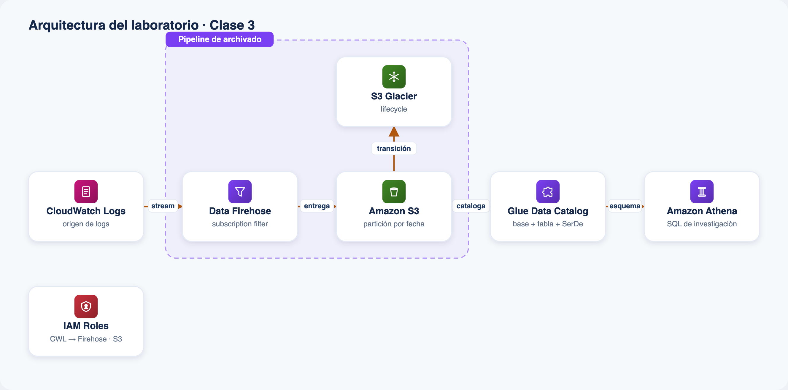

# Laboratorio · Clase 3 — Archivado, ciclo de vida y explotación con Athena

Construí el pipeline de **archivado económico** de logs y explotalos con **SQL en
Amazon Athena** para una investigación de seguridad, todo definido como código en
una única plantilla de CloudFormation.

## Arquitectura



*Todos los componentes que despliega `template.yaml`.*

## Qué despliega

El `template.yaml` crea, en una sola pasada, el pipeline completo:

| Recurso | Servicio | Para qué |
|---|---|---|
| Log group `/<prefijo>/cloudtrail-eventos` | CloudWatch Logs | Origen de los eventos (forma CloudTrail) |
| Subscription filter | CloudWatch Logs | Empuja los eventos a Firehose en near real-time |
| Delivery stream `<prefijo>-archivado` | Amazon Data Firehose | Descomprime, bufferea y escribe en S3 particionado por fecha |
| Bucket `<prefijo>-archivo-…` | Amazon S3 | Data lake de logs, con regla de Lifecycle a Glacier |
| Regla de Lifecycle | S3 / Glacier | Transiciona el prefijo `cloudtrail/` a Glacier tras N días |
| Database + tabla `cloudtrail_eventos` | AWS Glue Data Catalog | Describe los datos en S3 (JSON SerDe + partition projection) |
| Workgroup `<prefijo>-wg` | Amazon Athena | Aísla las queries, result location y límite de bytes escaneados |
| Named query | Amazon Athena | Consulta de investigación lista para ejecutar |
| Instancia t3.micro | EC2 | Genera eventos de ejemplo (incluye un `AuthorizeSecurityGroupIngress` abriendo el puerto 22) |
| Roles IAM | IAM | Enlazan cada salto del pipeline con least privilege |

Arquitectura: **EC2 → CloudWatch Logs → (subscription filter) → Firehose → S3
(particionado por fecha, lifecycle a Glacier) → Glue Data Catalog → Athena**.

## Requisitos

- Cuenta de AWS con permisos para crear los recursos anteriores.
- Región sugerida: `us-east-1`.
- Para el deploy por CLI: AWS CLI v2 configurado. Como la plantilla nombra roles
  IAM, hay que pasar `--capabilities CAPABILITY_NAMED_IAM`.

## Deploy rápido

### Consola
1. **CloudFormation › Create stack › With new resources**.
2. **Upload a template file** → subí `template.yaml`.
3. Nombre del stack (por ejemplo `obs-clase-3`), revisá los parámetros.
4. Marcá la casilla de capacidades IAM y **Submit**. Esperá `CREATE_COMPLETE`.

### CLI
```bash
aws cloudformation deploy \
  --stack-name obs-clase-3 \
  --template-file template.yaml \
  --parameter-overrides file://parameters.example.json \
  --capabilities CAPABILITY_NAMED_IAM \
  --region us-east-1
```

> `deploy` no acepta el formato de lista de `parameters.example.json` en
> `--parameter-overrides` directamente en todas las versiones; si falla, usá
> `create-stack --parameters file://parameters.example.json` o pasá los
> parámetros inline (`Clave=Valor`).

## Verificar

```bash
# Objetos ya archivados en S3 (esperá ~1-2 min de buffering de Firehose).
aws s3 ls s3://<bucket>/cloudtrail/ --recursive

# Ejecutar la consulta de investigación (ver la named query en Athena).
aws athena start-query-execution \
  --work-group <prefijo>-wg \
  --query-string "SELECT eventtime, useridentity.arn, sourceipaddress \
    FROM \"<prefijo>_archivo_db\".\"cloudtrail_eventos\" \
    WHERE eventname='AuthorizeSecurityGroupIngress' AND anio='2026' AND mes='07';" \
  --region us-east-1
```

Los nombres exactos salen en la pestaña **Outputs** del stack.

## Costo

Objetivo: **< USD 1** si limpiás al terminar.

- EC2 t3.micro + disco gp3 de 8 GB por los minutos que dure el lab.
- Firehose se paga por volumen ingerido (unos pocos KB en el lab).
- S3 y Glacier: centavos por el volumen de ejemplo.
- Athena: se factura por datos escaneados; el workgroup limita cada query a
  100 MB y las tablas están particionadas para escanear poco.

## Limpieza

1. **Vaciá el bucket** (Firehose y Athena dejan objetos, y un bucket con
   contenido no se puede borrar):
   ```bash
   aws s3 rm s3://<bucket>/ --recursive
   ```
2. **Borrá el stack**:
   ```bash
   aws cloudformation delete-stack --stack-name obs-clase-3 --region us-east-1
   ```
   La plantilla no usa `DeletionPolicy: Retain`, así que todo se elimina.

Ver la [guía paso a paso](./guia.html) y el
[troubleshooting](./troubleshooting.md) para el detalle.
