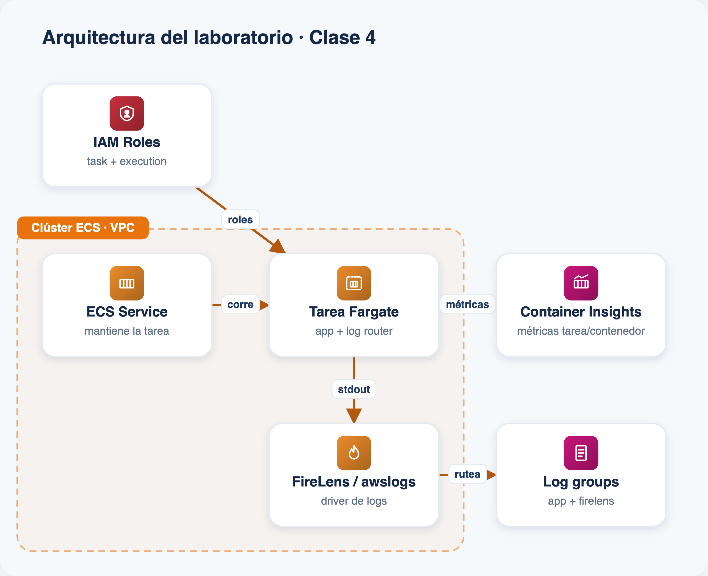

# Laboratorio · Clase 4 — Observabilidad de contenedores (ECS + Fargate)

Desplegá un **cluster ECS** con un servicio en **AWS Fargate**, con **Container
Insights (enhanced observability)** habilitado y los logs del contenedor
**ruteados con FireLens (Fluent Bit)** hacia CloudWatch Logs. Visualizá las
métricas a nivel de **tarea y contenedor** junto con los logs correlacionados,
todo definido como código en una única plantilla de CloudFormation.

## Arquitectura



*Todos los componentes que despliega `template.yaml`.*

## Qué despliega

El `template.yaml` crea, en una sola pasada, el laboratorio completo:

| Recurso | Servicio | Para qué |
|---|---|---|
| VPC single-AZ + subred pública + IGW + route table | Amazon VPC | Red mínima para que la tarea baje las imágenes públicas (sin NAT) |
| Security group de la tarea | Amazon VPC | Sin ingress (la app no se publica); egress abierto para el pull |
| Cluster `<prefijo>-cluster` | Amazon ECS | Cluster con **Container Insights `enhanced`** |
| Log group `/<prefijo>/app` | CloudWatch Logs | Destino final de los logs de la app (los escribe FireLens) |
| Log group `/<prefijo>/firelens` | CloudWatch Logs | Diagnóstico del propio sidecar Fluent Bit |
| Execution role | IAM | Pull de imagen + logs (managed `AmazonECSTaskExecutionRolePolicy`) |
| Task role | IAM | Permite a Fluent Bit escribir en el log group de la app (mínimo) |
| Task definition `<prefijo>-app` | ECS / Fargate | Contenedor **app** (httpd + logs a stdout) + sidecar **log_router** (FireLens) |
| Servicio `<prefijo>-svc` | Amazon ECS | Mantiene 1 tarea Fargate corriendo (`desiredCount: 1`) |

Arquitectura: **ECS Cluster (Container Insights enhanced) → Servicio Fargate →
Task (contenedor app → log driver `awsfirelens` → sidecar Fluent Bit → CloudWatch
Logs)**. Las métricas de CPU/memoria por tarea y contenedor las publica Container
Insights; los logs quedan en el log group de la app para correlacionar.

## Requisitos

- Cuenta de AWS con permisos para crear ECS, Fargate, VPC, IAM y CloudWatch Logs.
- Región sugerida: `us-east-1`.
- Para el deploy por CLI: AWS CLI v2 configurado. Como la plantilla **nombra roles
  IAM**, hay que pasar `--capabilities CAPABILITY_NAMED_IAM`.
- No se usa EC2/AMI: **Fargate no expone el host**, así que no hay instancias ni
  parámetro de AMI que administrar.

## Deploy rápido

### Consola
1. **CloudFormation › Create stack › With new resources**.
2. **Upload a template file** → subí `template.yaml`.
3. Nombre del stack (por ejemplo `obs-clase-4`), revisá los parámetros.
4. Marcá la casilla de capacidades IAM y **Submit**. Esperá `CREATE_COMPLETE`.

### CLI
```bash
aws cloudformation deploy \
  --stack-name obs-clase-4 \
  --template-file template.yaml \
  --parameter-overrides file://parameters.example.json \
  --capabilities CAPABILITY_NAMED_IAM \
  --region us-east-1
```

> Si tu versión de `deploy` no acepta el formato de lista de
> `parameters.example.json`, usá `create-stack --parameters file://parameters.example.json`
> o pasá los parámetros inline (`Clave=Valor`).

## Verificar

```bash
# Estado del servicio (esperá a que running == desired == 1).
aws ecs describe-services \
  --cluster <prefijo>-cluster --services <prefijo>-svc \
  --query "services[0].{status:status,running:runningCount,desired:desiredCount}" \
  --region us-east-1

# Logs de la app entregados por FireLens (Fluent Bit).
aws logs tail /<prefijo>/app --follow --region us-east-1
```

En la consola: **CloudWatch › Container Insights › Performance monitoring**,
elegí `ECS Clusters` y tu cluster para ver las métricas por **cluster, servicio,
tarea y contenedor**. Los nombres exactos salen en la pestaña **Outputs** del
stack (incluye un enlace directo a Container Insights).

## Costo

Objetivo: **< USD 1** si limpiás al terminar.

- **Fargate:** 1 tarea de 0.25 vCPU / 0.5 GB corriendo solo durante el lab
  (centavos por hora).
- **Container Insights (enhanced):** factura por observaciones/métricas emitidas;
  mantené el lab pocas horas y limpiá.
- **CloudWatch Logs:** unos pocos KB de ingesta y retención corta (3 días).
- **VPC/IGW/subred:** sin costo por hora (no se crea NAT Gateway).

## Limpieza

1. **Borrá el stack** (baja el servicio, la tarea y toda la red):
   ```bash
   aws cloudformation delete-stack --stack-name obs-clase-4 --region us-east-1
   ```
   La plantilla **no** usa `DeletionPolicy: Retain`, así que todo se elimina. No
   hay bucket S3 ni objetos que vaciar en este lab.
2. Verificá que el cluster ya no aparezca en **ECS › Clusters** y que los log
   groups se hayan borrado (o borralos a mano si querés conservar el historial).

Ver la [guía paso a paso](./guia.html) y el
[troubleshooting](./troubleshooting.md) para el detalle, incluido el escenario de
investigación (forzar reinicios y correlacionar el pico de métricas con los logs).
