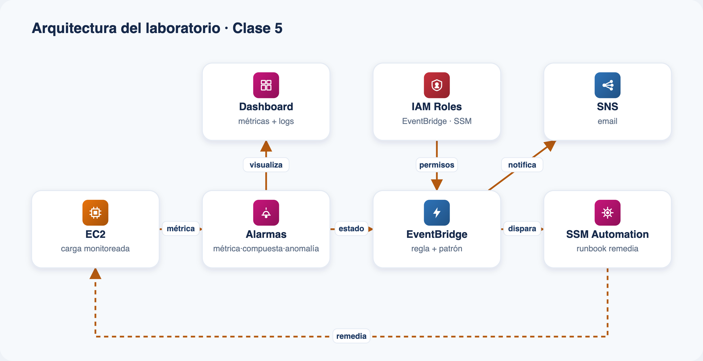

# Laboratorio · Clase 5 — Alertas, respuesta automatizada y cierre end-to-end

Cerrá el stack completo de observabilidad: **alarmas** (de métrica, compuesta y
por detección de anomalía), una regla de **EventBridge** que dispara un **runbook
de SSM Automation** (auto-remediación), notificaciones por **SNS** y un
**dashboard de CloudWatch unificado**. Todo definido como código en una única
plantilla de CloudFormation.

## Arquitectura



*Todos los componentes que despliega `template.yaml`.*

## Qué despliega

El `template.yaml` crea, en una sola pasada, el cierre end-to-end:

| Recurso | Servicio | Para qué |
|---|---|---|
| VPC + subred pública + IGW | EC2 / VPC | Red mínima single-AZ con salida a internet |
| Instancia `t3.micro` | EC2 | Host monitoreado; simula el incidente de CPU |
| CloudWatch agent (config en SSM) | CloudWatch / SSM | Publica métricas del SO y logs de la app |
| Log group `/observabilidad/<stack>/app` | CloudWatch Logs | Fuente del widget de logs y de Logs Insights |
| Alarma `…-cpu-alta` | CloudWatch Alarms | Alarma de **métrica** sobre `CPUUtilization` |
| Alarma `…-cpu-anomalia` | CloudWatch Alarms | Alarma por **detección de anomalía** (banda dinámica) |
| Alarma `…-cpu-compuesta` | CloudWatch Alarms | Alarma **compuesta**: métrica AND anomalía (reduce ruido) |
| Tópico `…-alertas` + suscripción | SNS | Notificación accionable por **email** |
| Runbook `…-remediar-cpu` | SSM Automation | **Auto-remediación**: detiene la carga y deja constancia |
| Regla `…-alarma-a-runbook` | EventBridge | Ante `ALARM` de la compuesta, dispara el runbook |
| Dashboard `…-unificado` | CloudWatch Dashboards | Widgets de métricas, estado de alarmas y logs |
| Roles IAM (instancia, Automation, EventBridge) | IAM | Least privilege en cada salto |

Arquitectura: **EC2 (CPU alta) → Alarma de métrica + Alarma de anomalía →
Alarma compuesta → (a) SNS → email  y  (b) EventBridge → SSM Automation
(auto-remediación)**. En paralelo, todo se visualiza en el **dashboard
unificado** (métricas + logs).

## Requisitos

- Cuenta de AWS con permisos para crear los recursos anteriores.
- Una dirección de **email** válida para la suscripción SNS (vas a confirmar el
  correo de suscripción).
- Región sugerida: `us-east-1`.
- Para el deploy por CLI: AWS CLI v2 configurado. Como la plantilla nombra roles
  IAM, hay que pasar `--capabilities CAPABILITY_NAMED_IAM`.

## Deploy rápido

### Consola
1. **CloudFormation › Create stack › With new resources**.
2. **Upload a template file** → subí `template.yaml`.
3. Nombre del stack (por ejemplo `obs-clase-5`) y completá **NotificationEmail**.
4. Marcá la casilla de capacidades IAM y **Submit**. Esperá `CREATE_COMPLETE`.
5. **Confirmá la suscripción**: abrí el email de AWS Notifications y hacé clic en
   *Confirm subscription*.

### CLI
```bash
aws cloudformation deploy \
  --stack-name obs-clase-5 \
  --template-file template.yaml \
  --parameter-overrides NotificationEmail=tu-email@ejemplo.com \
  --capabilities CAPABILITY_NAMED_IAM \
  --region us-east-1
```

> `deploy` no acepta el formato de lista de `parameters.example.json` en
> `--parameter-overrides` en todas las versiones; si preferís el archivo, usá
> `create-stack --parameters file://parameters.example.json`.

## Verificar

```bash
# 1) Ver las tres alarmas creadas.
aws cloudwatch describe-alarms \
  --alarm-names obs-clase-5-cpu-alta obs-clase-5-cpu-anomalia obs-clase-5-cpu-compuesta \
  --query "MetricAlarms[].AlarmName" --region us-east-1

# 2) Simular el incidente (alto uso de CPU) dentro de la instancia.
#    El nombre exacto sale en el Output SimularIncidenteCommand.
aws ssm send-command --document-name AWS-RunShellScript \
  --targets Key=InstanceIds,Values=<InstanceId> \
  --parameters 'commands=["/usr/local/bin/simular-incidente.sh &"]' \
  --region us-east-1

# 3) A los ~2-3 min: la compuesta pasa a ALARM → email por SNS + runbook.
aws ssm describe-automation-executions \
  --filters Key=DocumentNamePrefix,Values=obs-clase-5-remediar-cpu \
  --region us-east-1
```

Los nombres/ARNs exactos y los enlaces de consola salen en la pestaña
**Outputs** del stack (`DashboardUrl`, `AlarmsConsoleUrl`, etc.).

## Costo

Objetivo: **< USD 1** si limpiás al terminar.

- EC2 t3.micro + disco gp3 de 8 GB por los minutos que dure el lab.
- CloudWatch: alarmas (incluidas la de anomalía y la compuesta), un dashboard y
  unos pocos MB de logs; centavos en la práctica.
- SNS y EventBridge: prácticamente gratis al volumen del lab.
- SSM Automation: sin costo por la ejecución del runbook a esta escala.

## Limpieza

La plantilla **no** usa `DeletionPolicy: Retain`, así que borrar el stack elimina
todo. El log group se borra con el stack.

```bash
aws cloudformation delete-stack --stack-name obs-clase-5 --region us-east-1
```

> No hay bucket S3 en este lab, así que no queda nada que vaciar a mano. Si
> agregaste recursos propios (por ejemplo un bucket para resultados), vacialos
> antes de borrar el stack.

Ver la [guía paso a paso](./guia.html) y el
[troubleshooting](./troubleshooting.md) para el detalle y el escenario de
investigación.
